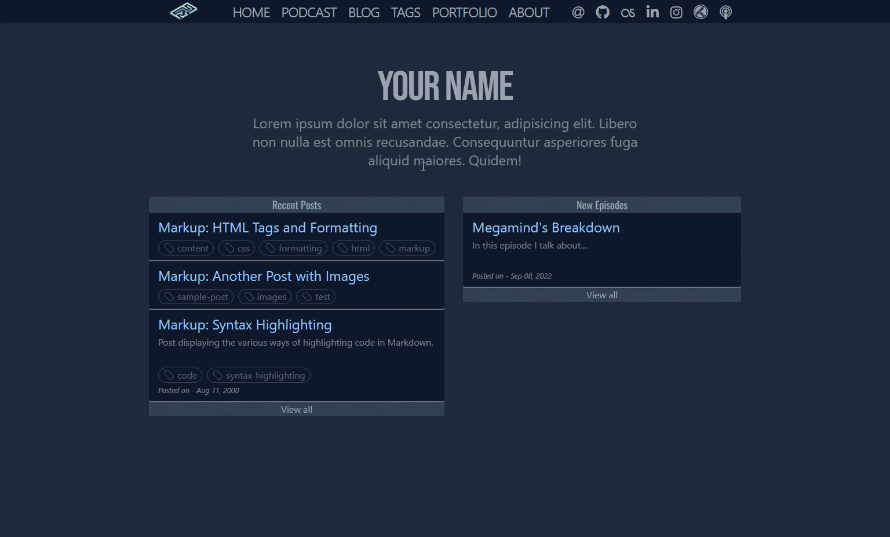

# Nuboard-theme
[](https://badgen.net/rubygems/v/nuboard-theme "View this project in Rubygems")
[](https://rubygems.org/gems/nuboard-theme "Number of Gem downloads")
---


[**Nuboard-theme**](https://nuboard-theme.pages.dev/) is a minimal, responsive, and powerful  Jekyll theme and is the best suite for your podcast, case study, and project showcase.

To use it, you must first clone it on your system or [download](https://github.com/hatchedland/nuboard-theme/archive/refs/heads/master.zip) the zip file.

## Prerequisite
To use it, you must first have the latter dependencies installed.
-   [Ruby](https://www.ruby-lang.org/en/downloads/) version **2.5.0** or higher, including all development headers (check your Ruby version using `ruby -v`)
-   [RubyGems](https://rubygems.org/pages/download) (check your Gems version using `gem -v`)
-   [GCC](https://gcc.gnu.org/install/) and [Make](https://www.gnu.org/software/make/) (check versions using `gcc -v`,`g++ -v`, and `make -v`)
-   [NPM](https://www.npmjs.com/) for tailwind


## Installation
```console
gem install nuboard-theme
```
For the dependencies
```console
bundle
```
This command installs the Gems mentioned in your `Gemfile.lock.`

And to make tailwind work.

``` console
npm install
```

## Running Local Server
```console
bundle exec jekyll serve
```

> **_NOTE:_**  If you are using Ruby version 3.0.0 or higher, step 5 [may fail](https://github.com/github/pages-gem/issues/752). You may fix it by adding `webrick` to your dependencies: `bundle add webrick`

## License
This work is published under [MIT](https://github.com/cotes2020/jekyll-theme-chirpy/blob/master/LICENSE) License.
